# How to create .Net Visual Studio Multi Projects Solution Template and deploy Nuget Package?

## Create Sample Project

To begin with, we create our sample project by going to the folder where we keep our repositories. I am using [dotnet CLI](https://docs.microsoft.com/tr-tr/dotnet/core/tools/) with powershell in Windows 10 but you can use different terminals and OS (MACOS, Linux etc.) 

```powershell
PS> mkdir Matech.Sample.Template
PS> cd Matech.Sample.Template
```

Add some class library projects (Application, Domain, Infrastructure) and Web Api project.

```powershell
PS Matech.Sample.Template> dotnet new classlib -n Application
PS Matech.Sample.Template> dotnet new classlib -n Domain
PS Matech.Sample.Template> dotnet new classlib -n Infrastructure
PS Matech.Sample.Template> dotnet new webapi -n WebApi
```

Add Solution item

```powershell
PS Matech.Sample.Template> dotnet new sln
```

Add multiple C# projects to a solution `Matech.Sample.Template.sln` using a globbing pattern (Windows PowerShell only):

```powershell
PS Matech.Sample.Template> dotnet sln Matech.Sample.Template.sln add (ls -r **/*.csproj)
```

Add multiple C# projects to a solution using a globbing pattern (Unix/Linux only):

```powershell
PS Matech.Sample.Template> dotnet sln Matech.Sample.Template.sln add **/*.csproj
```

You can check [dotnet sln](https://docs.microsoft.com/tr-tr/dotnet/core/tools/dotnet-sln).


### Matech.Sample.Template Project

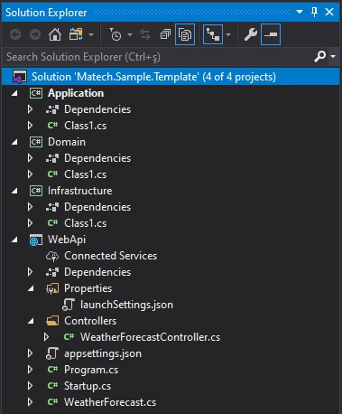

Let's go to the folder where we created our project and add new classes to our project.

`Domain` will contain all entities, enums, exceptions, interfaces, types and logic specific to the domain layer. If you are interested in Clean Architecture, you can check my public open source [solution template for creating a ASP.NET Core Web Api following the principles of Clean Architecture](https://github.com/iayti/CleanArchitecture).

```csharp
namespace Domain.Entities
{
    using System.Collections.Generic;

    public class City 
    {
        public City()
        {
            Districts = new List<District>();
        }

        public int Id { get; set; }

        public string Name { get; set; }


        public IList<District> Districts { get; set; }
    }
}
```

```csharp
namespace Domain.Entities
{
    public class District 
    {
        public int Id { get; set; }

        public string Name { get; set; }

        public int CityId { get; set; }
        public City City { get; set; }

    }
}
```

`Infrastructure` layer contains classes for accessing external resources such as file systems, web services, smtp, and so on. These classes should be based on interfaces defined within the application layer.

```csharp
namespace Infrastructure
{
    using Domain.Entities;
    using Microsoft.EntityFrameworkCore;

    public class ApplicationDbContext : DbContext
    {
        public DbSet<City> Cities { get; set; }
        public DbSet<District> Districts { get; set; }

        protected override void OnConfiguring(DbContextOptionsBuilder optionsBuilder)
        {
            optionsBuilder.UseSqlServer("Server=<SQLSERVER>; Database=Sample.TemplateDB; User Id = <YOUR_ID>; Password=<YOUR_PASSWORD>; MultipleActiveResultSets=true;");
        }
    }
}
```

### Prerequisites for Database Migrations
* If you don't have [Entity Framework Core tools reference - .NET Core CLI](https://docs.microsoft.com/tr-tr/ef/core/miscellaneous/cli/dotnet), Install

```powershell
PS Matech.Sample.Template> dotnet tool install --global dotnet-ef
```
* Add Domain reference to Infrastructure project

* Add Application and Infrastructure reference to WebApi project

* Dependencies
    * Infrastructure
        * Microsoft.EntityFrameworkCore.SqlServer
        * Microsoft.AspNetCore.Diagnostics.EntityFrameworkCore
    * WebApi
        * Microsoft.EntityFrameworkCore.Tools


Add initial create for database.
* `--project Infrastructure` (optional if in this folder)

* `--startup-project WebApi`

* `--output-dir Migrations`

```powershell
PS Matech.Sample.Template> dotnet ef migrations add "SampleMigration" --project Infrastructure --startup-project WebApi --output-dir Migrations
```

Sample template project is finally ready :smile:

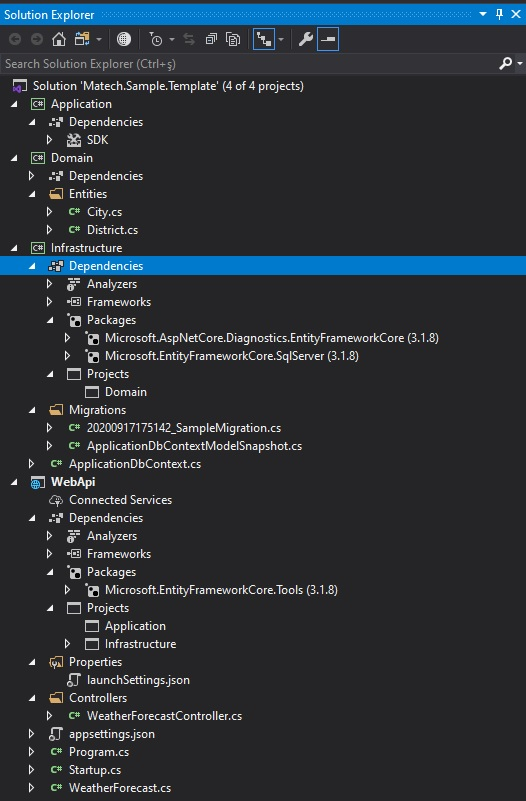

### Adding .template.config and testing locally.

The example below demonstrates the file and folder structure of using a template.json to create a template pack. Check the [microsoft docs](https://docs.microsoft.com/en-us/dotnet/core/tools/custom-templates).

```
Matech.Sample.Template
|___.template.config
    |___template.json
|___Application
|___Domain
|___Infrastructure
|___WebApi
|___Matech.Sample.Template.sln
```

Configure your `template.json` and that's it :smile:. 

```json
{
  "$schema": "http://json.schemastore.org/template",
  "author": "ilker Ayti", // author name
  "classifications": [], // Web/MVC/WebApi
  "name": "Matech Sample Template",
  "identity": "Matech.Sample.Template", // Unique identity for Nuget
  "groupIdentity": "Matech.Sample.Template",
  "shortName": "mst", // short name for dotnet new mat creating new project using this template
  "tags": {
    "language": "C#",
    "type": "project"
  },
  "sourceName": "MatechSample",
  "preferNameDirectory": true,
  "sources": [
    {
      "source": "./",
      "target": "./",
      "exclude": [
        "**/README.md",
        "**/nuget.config",
        "**/LICENSE",
        "**/.gitattributes",
        "**/.gitignore",
        "**/*.nupkg",
        "**/[Bb]in/**",
        "**/[Oo]bj/**",
        ".template.config/**/*",
        ".vs/**/*",
        "**/*.filelist",
        "**/*.user",
        "**/*.lock.json",
        "**/.git/**",
        "**/.github/**",
        "*.nuspec",
        "**/node_modules/**"
      ]
    }
  ]
}
```

Let's try our template locally.

```powershell
PS > dotnet new --install <Project Folder Path>\Matech.Sample.Template
```

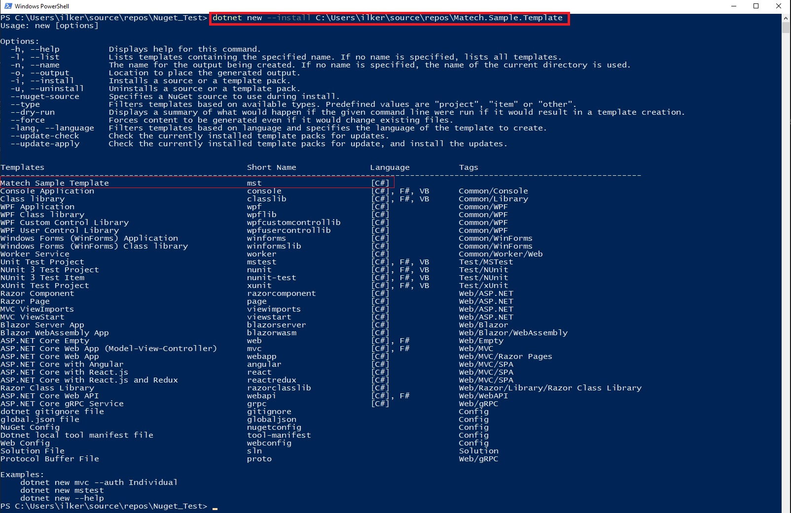

Create a new project using our local template.

```powershell
PS> mkdir Test_Local_Sample_Template
PS> cd Test_Local_Sample_Template
PS Test_Local_Sample_Template> dotnet new mst
```

Project was created :smile:

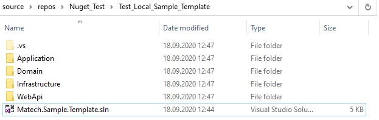

Check the project and if anything is wrong, change the settings you made and install template locally for testing again.

Uninstall Template

```powershell
PS> dotnet new --uninstall
PS> dotnet new -u <Project Folder Path>\Matech.Sample.Template
```

## Configure Nuget Deployment

First you need to create an account on [nuget.org](https://www.nuget.org/) like my profile [ilkerayti](https://www.nuget.org/profiles/ilkerayti). 

### Download Nuget.exe and add to Path

Actually you don't need to add path Nuget.exe but it is a very useful usage. [Download Nuget's latest version.](https://www.nuget.org/downloads) Windows 10 search: Edit the system environment variables.

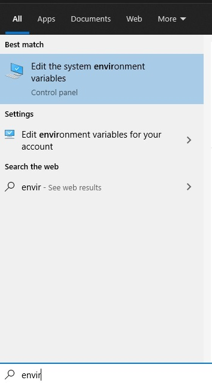

Go to Environment Variables

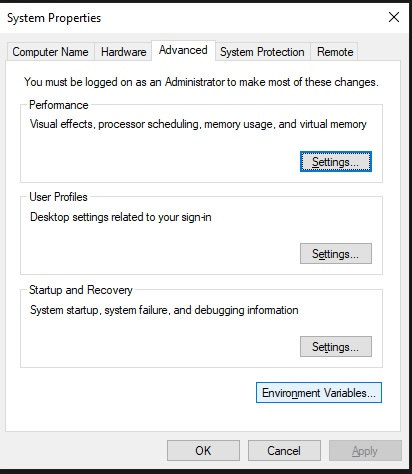

Go to System variables Path with double click.

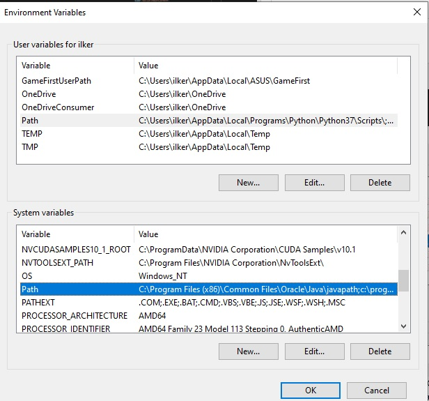

Add New nuget.ex file location in your system.

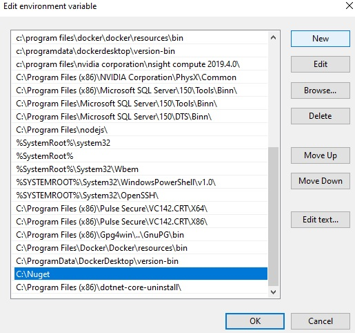

### Configure .nuspec file

Open terminal in your Matech.Sample.Template project folder

```powershell
PS Matech.Sample.Template> nuget spec
```

Package.nuspec file must be created in your project folder.

```xml
<?xml version="1.0" encoding="utf-8"?>
<package >
  <metadata>
    <id>Matech.Sample.Template</id>
    <version>1.0.0</version>
    <authors>ilker Ayti</authors>
    <requireLicenseAcceptance>false</requireLicenseAcceptance>
    <license type="expression">MIT</license>
    <projectUrl>https://github.com/iayti/Matech.Sample.Template</projectUrl>
    <repository type="git" url="https://github.com/iayti/Matech.Sample.Template" branch="master" />
    <description>Matech Sample Template for Web Api and .NET Core 3.1.</description>
    <copyright>$copyright$</copyright>
    <tags>dotnet-core webapi csharp template</tags>
    <packageTypes>
      <packageType name="Template" />
    </packageTypes>
  </metadata>
  <files>
    <file src="**" exclude="**\bin\**\*;**\obj\**\*;**\*.user;**\*.lock.json;**\.DS_Store;**\.git\**\*;**\.github\**\*;**\.vs\**\*;**\*LICENSE;**\*.gitattributes;**\*README.md;**\*.gitignore;**\*nuget.config;" target="/content" />
  </files>
</package>
```

After the configuration, we finally created a .nupkd file for nuget.org upload or push.

```powershell
PS Matech.Sample.Template> nuget pack Package.nuspec -NoDefaultExcludes
```

If you don't add nuget.ex to Environment System Variable Path just use the nuget.exe

```powershell
PS Matech.Sample.Template> C:\Nuget\nuget.exe pack Package.nuspec -NoDefaultExcludes
```

Package was created.


[Nuget Package Explorer](https://www.microsoft.com/en-us/p/nuget-package-explorer/9wzdncrdmdm3) is very useful tool for checking .nupkd file before publish.

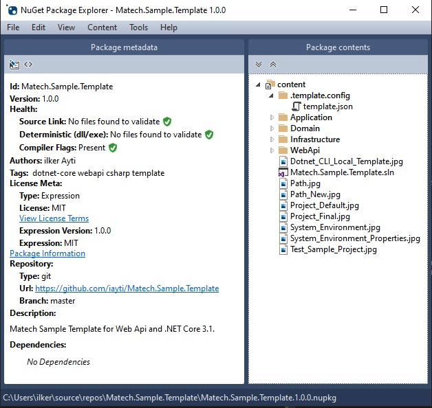

Finally we can upload to packages to Nuget servers :smile:

Upload Package

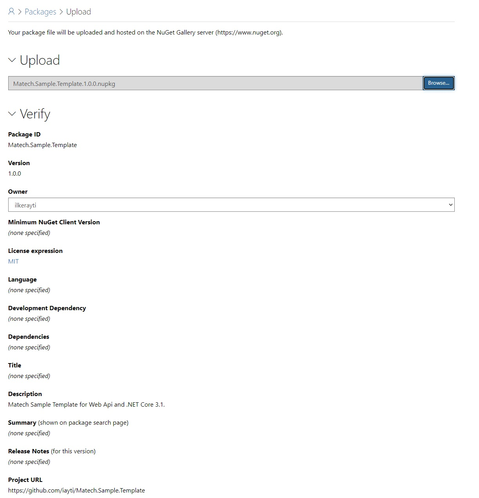


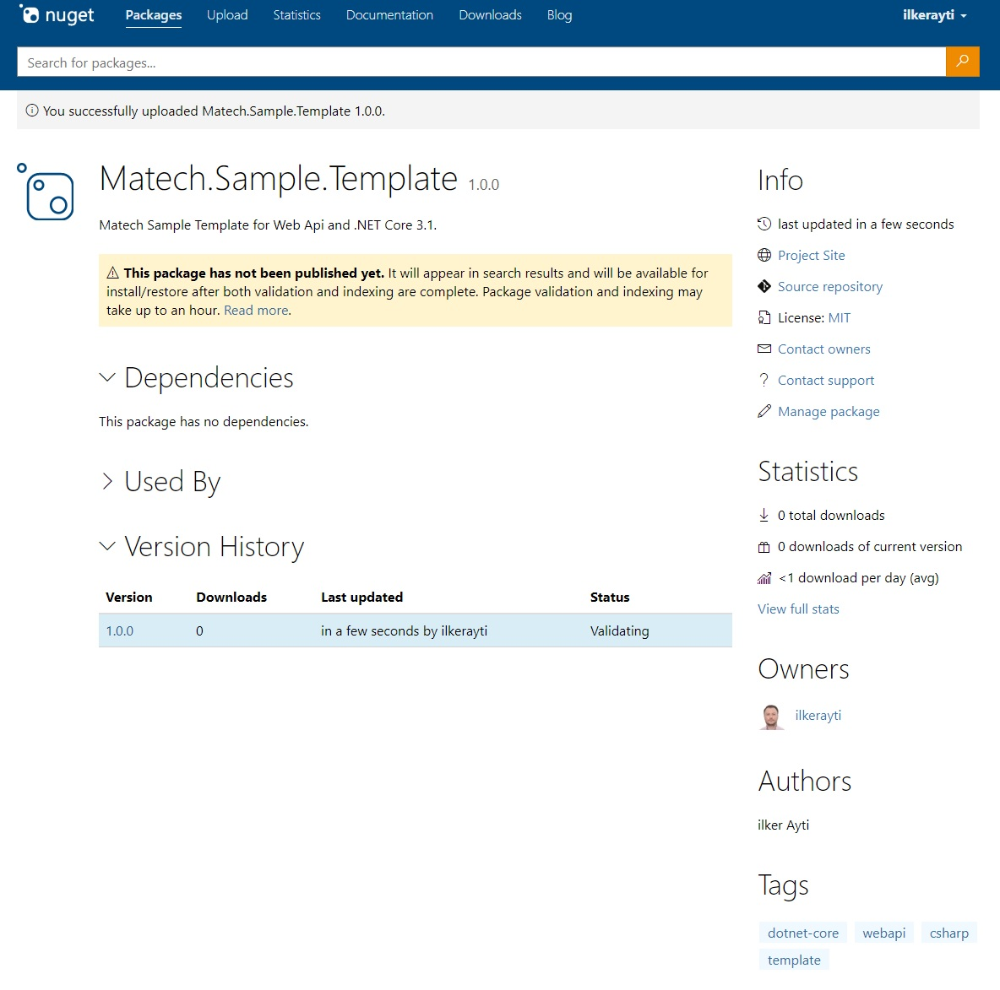

Check [Matech.Sample.Template](https://www.nuget.org/packages/Matech.Sample.Template)

## Sample Template Usage

Open terminal in your repos folder.

```powershell
PS> mkdir Your.Template.Name
PS> cd Your.Template.Name
```

Template will use your folder name as project name

```powershell
PS Your.Template.Name> dotnet new --install Matech.Sample.Template
PS Your.Template.Name> dotnet new mst
```

## Support

If you are having problems, please let us know by [raising a new issue](https://github.com/iayti/MatechSampleTemplate/issues/new/choose).

## License

This project is licensed with the [MIT license](LICENSE).


